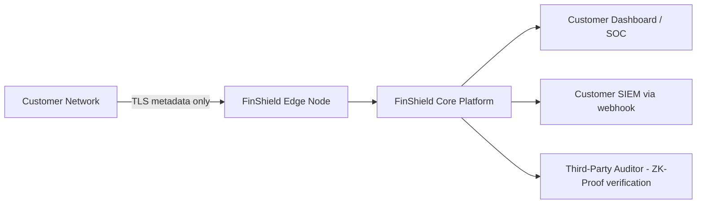
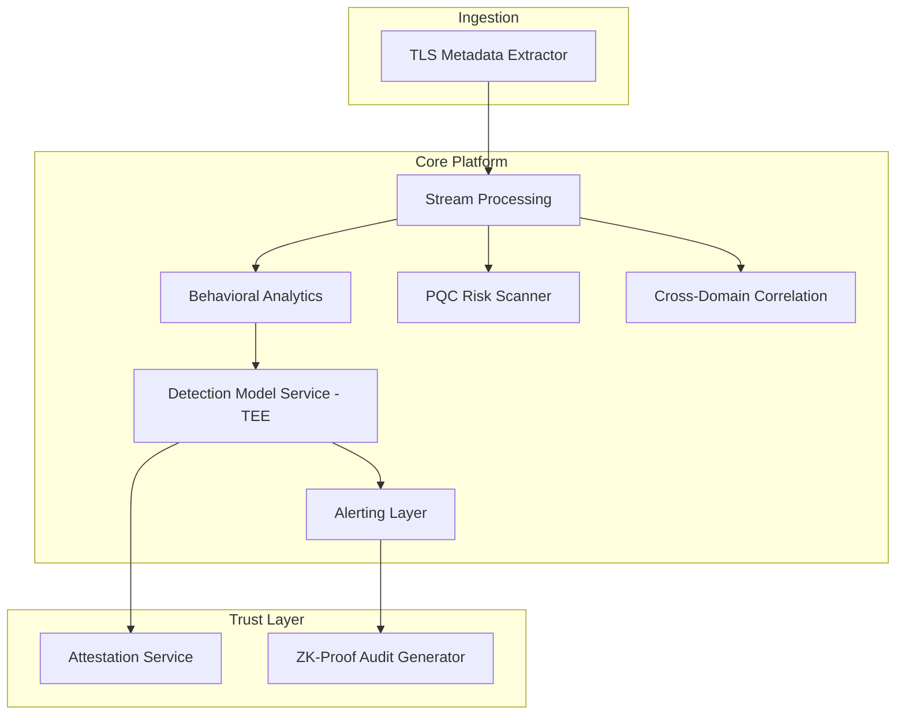

# High-Level Architecture
## FinShield AI

**Version:** 0.1 (Draft) | **Classification:** Confidential

---

## 1. Purpose
Describes the system at a level suitable for executive, customer, and cross-team review — components and data flow, not implementation detail (see Low-Level Architecture for that).

## 2. Architecture Principles
- Metadata-only processing — no decryption capability anywhere in the system.
- Modular by design — each of the 8 strategic modules is a loosely coupled service.
- Edge-first for latency-critical paths (healthcare robotics, smart city traffic).
- Zero-trust internal networking.

## 3. System Context Diagram

## 4. High-Level Component View

## 5. Major Components (Summary)

| Component | Role |
|-----------|------|
| Edge Node | Metadata extraction, no payload retained |
| Core Platform | Detection, correlation, alerting |
| Trust Layer | Attestation and compliance proof generation |
| Dashboard | Analyst/compliance-facing interface |

## 6. Cross-Cutting Concerns
- **Multi-tenancy:** enforced at storage and query layer (see Low-Level Architecture, Database Schemas).
- **Compliance:** ZK-Proof generation is a first-class output, not an afterthought.
- **Resilience:** graceful degradation if TEE or edge connectivity is unavailable.

## 7. Deployment Topology (Summary)
- Edge nodes: customer premises or MEC (5G/6G Phase 2+).
- Core platform: cloud region matching customer data-residency requirement.
- Dashboard: served via API gateway, no direct DB access from client.

*See Low-Level Architecture for service boundaries, storage schema, and technology choices. See Deployment Architecture for environment/infrastructure topology.*
