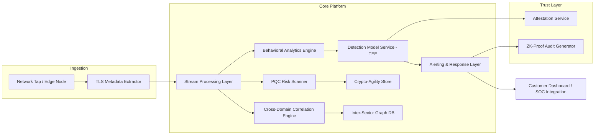

# System Architecture Plan
## FinShield AI — High-Level & Low-Level Design

**Version:** 0.1 (Draft) | **Classification:** Confidential

---

## 1. Architecture Principles
- Metadata-only processing — no decryption capability exists in the data path.
- Modular by design — each of the 8 strategic modules is a loosely coupled service.
- Edge-first for latency-critical paths (healthcare robotics, smart city traffic).
- Zero-trust internal networking — every service-to-service call authenticated.

## 2. High-Level Architecture

## 3. Component Breakdown

| Component | Responsibility | Module |
|-----------|-----------------|--------|
| TLS Metadata Extractor | Parses handshake, JA3/JA4 fingerprint, cipher suite, no payload | PQC Readiness |
| Crypto-Agility Store | Tracks endpoint PQC posture over time | PQC Readiness |
| Stream Processing Layer | Real-time event bus (metadata records) | Core |
| Behavioral Analytics Engine | Anomaly scoring, baseline modeling | Core |
| Detection Model Service | ML inference, runs inside TEE | TEE Integration |
| Attestation Service | Issues cryptographic proof of model integrity | TEE Integration |
| Adversarial Sandbox | Generates adversarial samples, retrains models | Adversarial Resilience |
| Inter-Sector Graph DB | Maps shared infra across sectors | Cross-Domain Correlation |
| Digital Twin Environment | Isolated replica for simulation | Digital Twin |
| ZK-Proof Audit Generator | Produces compliance tokens | ZK-Proof Audit Trail |
| Spiking Neural Net Path | Timing-anomaly detection | Bio-Inspired Detection |
| MEC Micro-Detector | Lightweight edge inference | 5G/6G Edge |
| Alerting & Response Layer | Routes detections to SOC/dashboard | Core |

## 4. Data Flow (Metadata Path)
1. Edge node captures TLS handshake metadata only (SNI, cipher suite, JA3/JA4, timing, byte counts).
2. Metadata published to stream processing layer.
3. Parallel consumption by PQC Scanner, Behavioral Analytics, Cross-Domain Correlation.
4. Detection model (in TEE) scores the event; attestation available on request.
5. High-confidence detections routed to Alerting Layer; low-confidence held for correlation window.
6. Optional: ZK-Proof Audit Generator produces a compliance token summarizing the processing window.

## 5. Low-Level Design Notes

### 5.1 Ingestion Layer
- Language/runtime: TBD by team preference (commonly Rust/Go for packet-level performance).
- No raw packet storage; extraction happens in-memory, discarded after metadata emission.

### 5.2 Storage Layer
- Time-series store for anomaly scores (retention per Data Governance Plan).
- Graph database for Cross-Domain Correlation (property graph, e.g., shared-infrastructure edges).
- Object store for model artifacts, versioned.

### 5.3 ML Serving Layer
- Model inference isolated per TEE type (SGX/SEV-SNP/TrustZone) — abstraction layer to avoid vendor lock-in.
- Model registry tracks version, training data distribution hash, adversarial-hardening iteration.

### 5.4 Edge Layer (Phase 2)
- MEC-deployed micro-models: quantized, <10ms inference budget.
- Network slice awareness: policy engine tags traffic by slice (URLLC vs. mMTC) and applies differentiated rules.

## 6. Non-Functional Considerations
- Horizontal scalability of stream processing layer (partitioned by customer/tenant).
- Graceful degradation: if TEE unavailable, fallback to standard isolated container with reduced trust guarantee (flagged in output).
- Multi-tenancy isolation between fintech, healthcare, smart city customer data at the storage layer.

## 7. Technology Stack (Proposed — confirm with engineering)

| Layer | Candidate Technologies |
|-------|--------------------------|
| Stream processing | Kafka / Pulsar |
| Graph DB | Neo4j / Amazon Neptune |
| TEE runtime | Intel SGX SDK, AMD SEV-SNP, Gramine/Occlum |
| ML serving | Triton / TorchServe (adapted for enclave execution) |
| Time-series store | ClickHouse / TimescaleDB |
| Edge orchestration | K3s on MEC nodes |

## 8. Open Architecture Risks
- TEE performance overhead for high-throughput inference — needs benchmarking before Phase 2 commit.
- Graph DB query performance at cross-sector scale — needs load testing plan.
- Federated learning coordination latency across institutional participants — needs prototyping.

*Draft — diagrams and stack choices pending engineering review and PoC validation.*
