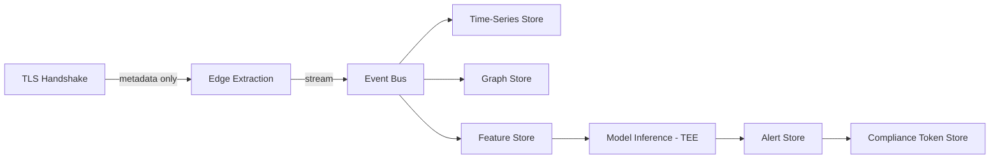

# Data Architecture
## FinShield AI

**Version:** 0.1 (Draft) | **Classification:** Confidential

**Note:** Distinct from Data Governance Plan (policy/ownership) and Data Dictionary (field-level spec) — this document covers how data physically flows and is architected across systems.

---

## 1. Purpose
Defines the end-to-end data architecture: ingestion, transport, storage, and lifecycle at a systems level.

## 2. Data Flow Architecture

## 3. Data Zones

| Zone | Description | Controls |
|------|-------------|----------|
| Ingestion zone | Ephemeral, in-memory metadata extraction | No persistence of anything beyond parsed fields |
| Streaming zone | Event bus, short-lived retention | Encrypted in transit, tenant-partitioned topics |
| Analytical zone | Time-series + graph stores | Encrypted at rest, row-level tenant isolation |
| Feature zone | Feature store for ML | Versioned, lineage-tracked (see Feature Engineering Spec) |
| Compliance zone | ZK-proof tokens, audit logs | Long retention (7 yr), immutable/append-only |

## 4. Data Lineage
- Every stored field traceable back to the raw metadata field it derived from (Data Dictionary) and the pipeline stage that produced it.
- Lineage metadata stored in the Feature Store alongside feature values (model version, transformation applied, source field).

## 5. Multi-Tenancy Architecture
- Physical or logical partitioning per tenant at every storage layer (row-level security in relational/time-series; separate graph namespaces or property-based partitioning in graph store).
- No shared indexes that could allow cross-tenant inference without going through the explicit correlation-service path.

## 6. Data Movement Controls
- Cross-region movement blocked by default at the architecture level (network policy + application check), not just documented policy — ties to Data Governance Plan §8.
- Cross-sector correlation reads via `correlation-graph-service` only — no direct cross-sector table joins permitted anywhere in the codebase.

## 7. Backup & Recovery Architecture
- Time-series and relational stores: point-in-time recovery, encrypted backups, cross-AZ replication.
- Graph store: periodic snapshot + write-ahead log replay.
- Object store (models, tokens): versioned buckets, immutable compliance token objects (write-once).
- Full detail in Disaster Recovery Plan.

## 8. Data Quality Architecture
- Schema validation at ingestion (reject/quarantine malformed records, don't silently drop — see Data Governance Plan §6).
- Automated anomaly checks on pipeline throughput/volume to catch silent data loss.

*Draft — validate against actual storage technology selection during Phase 1 implementation.*
