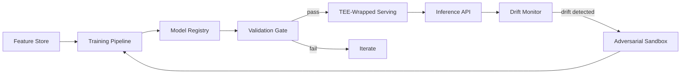

# ML Architecture
## FinShield AI

**Version:** 0.1 (Draft) | **Classification:** Confidential

---

## 1. Purpose
Defines how ML models are trained, served, secured, and maintained across FinShield's detection modules — the ML-specific layer beneath the general system architecture.

## 2. ML Pipeline Overview

## 3. Model Types by Module

| Module | Model Type (Candidate) | Notes |
|--------|--------------------------|-------|
| PQC Risk Scanner | Rule-based + lightweight classifier | Cipher classification is largely deterministic; ML layer for anomalous handshake patterns |
| Behavioral Analytics | Gradient-boosted trees / autoencoder | Baseline deviation detection |
| Adversarial Detector | Ensemble + meta-anomaly detector | Detects probing behavior against itself |
| Cross-Domain Correlation | Graph neural network (GNN) or graph algorithms | Depends on scale; start with algorithmic, evaluate GNN later |
| Bio-Inspired Detection | Spiking Neural Network (SNN) | Timing-based anomaly detection |
| Digital Twin | Simulation-driven, not a trained model per se | Uses production models against synthetic/replayed traffic |

## 4. Training Architecture
- Centralized training (Phase 1) using aggregated, anonymized data within a tenant boundary.
- Federated training (Phase 2+) for multi-institution collaboration, coordinated via TEE-enforced aggregation (see Architecture Decision Log ADR-002).
- All training runs logged per Experiment Tracking Log format — no untracked training runs permitted in staging/production pipelines.

## 5. Serving Architecture
- Inference wrapped in TEE for production (per ADR-002); fallback mode flagged `trust_level: reduced` if TEE unavailable.
- Edge-deployed models (5G/6G MEC): quantized, distilled versions of core models, sub-10ms budget.
- Model registry (PostgreSQL, per Database Schemas) tracks version, training data hash, TEE compatibility, deployment status.

## 6. Adversarial Resilience Loop
1. Adversarial Sandbox continuously generates evasion/poisoning samples against current production model.
2. Evasion Detection flags active probing (meta-anomaly).
3. Drift Monitor distinguishes natural concept drift from adversarial manipulation.
4. Confirmed adversarial pattern triggers Adversarial Retraining Pipeline — output re-enters Validation Gate, never auto-promoted (see Deployment & Rollback Plan).

## 7. Validation Gate (Summary)
Full criteria in Model Evaluation & Validation Report and Evaluation Rubrics. Gate requires:
- Precision/recall vs. target
- Adversarial robustness regression check
- Cross-sector consistency check
- TEE compatibility confirmed (if targeting TEE serving)

## 8. Monitoring
- Per-model dashboards: precision/recall proxy metrics (via analyst feedback), latency, drift score.
- Alerting on: latency SLA breach, drift threshold exceeded, cross-sector recall divergence.
- Ties into Monitoring & Observability doc for platform-wide alerting integration.

## 9. Model Lifecycle States
`staging → canary → production → retired`, matching Model Registry `status` field (Database Schemas §5) and Deployment & Rollback Plan sequencing.

*Draft — model type selections are candidates pending Phase 1 prototyping and benchmarking.*
