# CI/CD Documentation
## FinShield AI

**Version:** 0.1 (Draft) | **Classification:** Internal

---

## 1. Purpose
Defines the build, test, and release pipeline — the automated path from commit to production, enforcing every gate defined elsewhere in this document set.

## 2. Pipeline Stages

```mermaid
flowchart LR
    A[Commit / PR] --> B[Lint + Unit Tests]
    B --> C[SAST + Secrets Scan]
    C --> D[SCA Scan]
    D --> E[Build Artifacts/Containers]
    E --> F[Deploy to Staging]
    F --> G[SIT Suite]
    G --> H[DAST Scan]
    H --> I[Performance Test - release candidates]
    I --> J[Security Sign-Off Gate]
    J --> K[Canary Deploy - Production]
    K --> L[Full Rollout]
```

## 3. Gate Definitions (per stage)

| Stage | Blocking Condition |
|-------|----------------------|
| SAST + Secrets | Any Critical/High finding without approved exception (SAST Report §5) |
| SCA | Any Critical/High vulnerable dependency without approved exception (SCA Report §6) |
| SIT | Exit criteria not met (SIT Plan §5) |
| DAST | Any Critical/High finding (DAST Report §6) |
| Performance | p99 latency exceeds SLA threshold (Performance Test Report §7) |
| Security Sign-Off | Not obtained for changes touching Sensitive data paths (Security Sign-Off Record §2) |

## 4. Branching & Release Strategy
- Trunk-based development with short-lived feature branches.
- All merges to main require passing CI (lint, unit tests, SAST, SCA) plus one engineering + one security-relevant review for changes touching crypto/TEE/access-control code (Project Rules File §6).
- Release candidates tagged and promoted through staging → canary → production per Deployment & Rollback Plan.

## 5. Model-Specific Pipeline Extension
- Model training/retraining runs trigger a parallel pipeline: Experiment Tracking Log entry required → Model Evaluation & Validation Report → Evaluation Rubrics scoring → promotion gate (separate from application code pipeline, but both must pass before a release combining code + model ships).

## 6. Infrastructure Changes
- IaC changes (Terraform) run through `plan` in CI, require two approvals for `apply` to production (IaC Documentation §6).

## 7. Rollback Automation
- Pipeline supports one-click rollback to last-known-good artifact/model version, tied to Deployment & Rollback Plan triggers.

## 8. Audit Trail
- Every pipeline run logged with: commit hash, all gate results, approver identities — retained per Data Governance compliance-record schedule.

*Draft — tooling (e.g., GitHub Actions, GitLab CI, Jenkins) to be selected by engineering; gates defined here are non-negotiable regardless of tool choice.*
