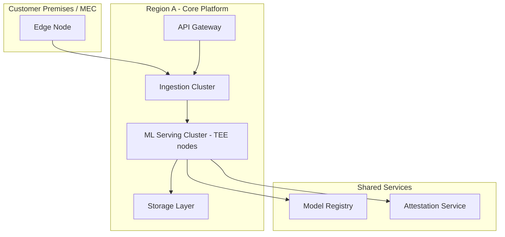

# Deployment Architecture
## FinShield AI

**Version:** 0.1 (Draft) | **Classification:** Confidential

**Note:** Covers environment/infrastructure topology. See CI/CD Documentation for the release pipeline, and Deployment & Rollback Plan (existing doc) for the operational sequencing/gating procedure.

---

## 1. Environment Topology

| Environment | Purpose | Data | Infra Footprint |
|-------------|---------|------|-------------------|
| Dev | Feature development | Synthetic only | Shared cluster, ephemeral namespaces |
| Staging | Pre-release validation, SIT/DAST/Performance testing | Synthetic + anonymized replay | Mirrors production topology at reduced scale |
| Canary | Limited-traffic production validation | Live (small %) | Subset of production nodes |
| Production | Live customer service | Live | Full scale, per-region |

## 2. Regional Deployment Model
- Core platform deployed per customer data-residency requirement (e.g., separate EU region for GDPR-bound tenants).
- Edge nodes deployed at customer premises or MEC location; connect to nearest compliant core region.
- No cross-region data replication of Sensitive-classified data without an active data-transfer agreement (Data Architecture §6).

## 3. Deployment Diagram

## 4. Infrastructure Sizing (Placeholder — confirm with Performance Test Report results)
| Component | Sizing Approach |
|-----------|-------------------|
| Ingestion cluster | Auto-scaled on event throughput per tenant partition |
| TEE inference nodes | Fixed pool + burst capacity, sized per Performance Test Report §3 targets |
| Storage layer | Auto-scaled storage, provisioned IOPS per time-series/graph DB requirements |

## 5. High Availability
- Multi-AZ deployment within each region for core platform.
- Edge nodes: local buffering on connectivity loss, no single point of failure for detection at the edge (per Low-Level Architecture §7).

## 6. Network Architecture
- API Gateway is the sole public ingress to core platform.
- Edge-to-core connection: outbound-initiated from edge where possible (reduces inbound attack surface, per Security Architecture §3).

## 7. Deployment Ownership
- Infra provisioned exclusively via IaC (no manual console changes in staging/production — enforced via policy-as-code, IaC Documentation §4).

*Draft — sizing and regional footprint to be finalized once customer commitments and Performance Test results are available.*
